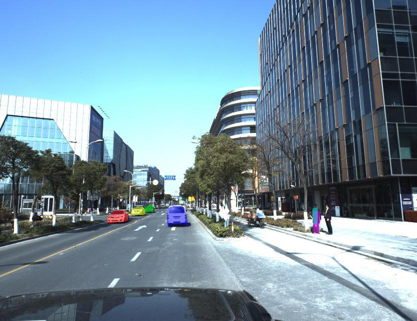

# CVPR-2018-WAD-Video-Segmentation-Challenge
This repository contains code for CVPR 2018 Video Segmentation Challenge. This project was done in collaboration with [Kai-Wei Tsou](https://github.com/KWTsou1220)

[Kaggle Competition Link](https://www.kaggle.com/c/cvpr-2018-autonomous-driving)  

[CVPR 2018 Workshop on Autonomous Driving Link](http://wad.ai/)  

  

[Result Video](https://www.youtube.com/watch?v=nRgVNnI4-AM)

[Pretrained Mask RCNN Model on MS COCO](https://drive.google.com/file/d/1sYdyGKJcpsh1lxEBEq8bPoeqnkq-bRMM/view?usp=sharing)  

[Mask RCNN Model finetuned on WAD Competition Dataset](https://drive.google.com/file/d/1qJh36j-dtNPAd1tmznq885iQ1EFO2p3N/view?usp=sharing)  

[Report](TSOU_RAI_Instance_Level_Object_Segmentation_In_Videos_VIC_Project_Report.pdf)

#### Credits
[1] [Matterport's MaskRCNN Tensorflow Implementation](https://github.com/matterport/Mask_RCNN)  